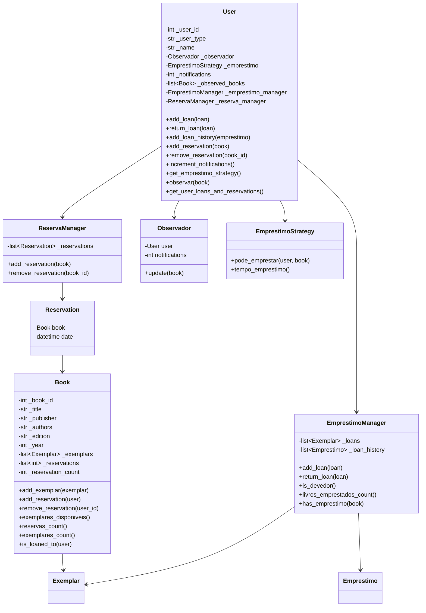
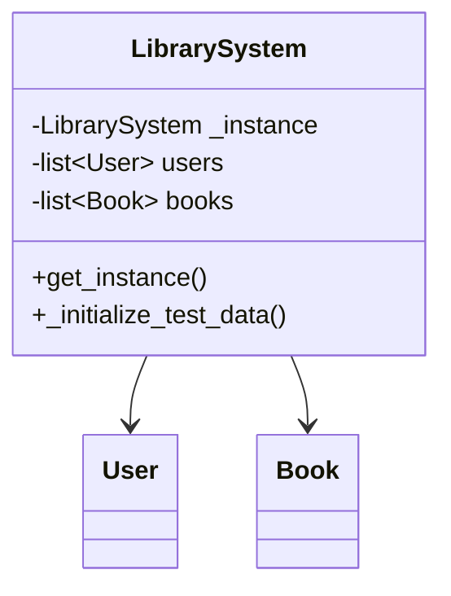
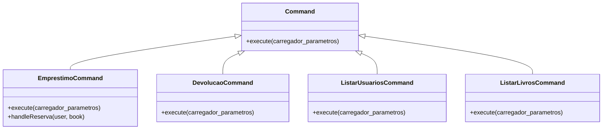
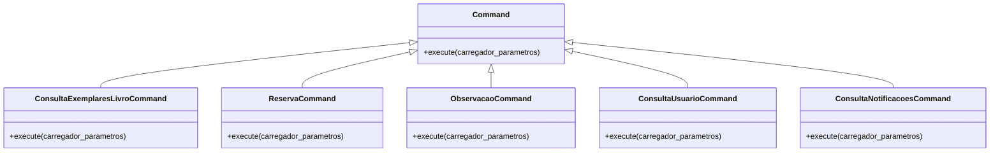

# Sistema de Biblioteca

## Diagramas de Classe

### Diagrama de Classe para `User`

### Diagrama de Classe para `LibrarySystem`

### Diagrama de Classe para `Command`

### Diagrama de Classe para `Command` (Parte 1)

### Diagrama de Classe para `Command` (Parte 2)

# Projeto MATA62 – Trabalho Prático: Sistema de Biblioteca

## Objetivo Geral

Desenvolver um sistema de gerenciamento de biblioteca em orientação a objetos que permita:
- Empréstimo, devolução e reserva de livros (com múltiplos exemplares);
- Registro de observação para professores sobre reservas;
- Consultas de informações de livros, usuários e notificações.

O sistema deve seguir os requisitos descritos no enunciado, utilizar os padrões de projeto (Singleton, Command e o padrão para seleção das regras de empréstimo sem condicionais) e ser implementado via linha de comando (sem interface gráfica).

---

## Estrutura Geral das Tarefas

### 1. **Análise e Planejamento**
- [ ] **Leitura e entendimento do enunciado**  
  *Revisar todos os requisitos e regras de negócio (empréstimo, devolução, reserva, observação e consultas).*

- [ ] **Definição dos componentes principais do sistema**  
  *Identificar classes de domínio (Livro, Exemplar, Usuário e suas subclasses, Empréstimo, Reserva, etc.) e os padrões a serem aplicados.*

- [ ] **Criação do diagrama de classes**  
  *Elaborar um diagrama de classes claro e dividido em páginas, se necessário, destacando:*
  - Classe que gerencia os dados (Singleton);
  - Classes de comando (Command Pattern);
  - Classes de negócio;
  - Relações entre as classes.

---

### 2. **Projeto e Implementação**

#### 2.1. **Classes de Negócio**
- [ ] **Usuários e suas variações**  
  - Criar a classe `Usuario` e as subclasses: `AlunoGraduacao`, `AlunoPosGraduacao` e `Professor`.
  - Implementar os atributos (código, nome) e métodos relevantes (empréstimos, reservas, etc.).

- [ ] **Livros e Exemplares**  
  - Desenvolver a classe `Livro` com atributos: código, título, editora, autores, edição, ano de publicação, etc.
  - Criar a classe `Exemplar` com atributos: código, status (disponível ou emprestado) e, se emprestado, detalhes do empréstimo.

- [ ] **Operações de Empréstimo, Devolução e Reserva**  
  - Implementar classes e métodos para as operações de **empréstimo**, **devolução** e **reserva**.
  - Garantir que as regras específicas de cada tipo de usuário sejam aplicadas sem o uso de condicionais (explorar padrões como Strategy).

- [ ] **Observação e Notificações**  
  - Desenvolver a funcionalidade de registro de observação de livros para professores, permitindo notificações quando houver mais de duas reservas simultâneas.
  - Implementar o contador de notificações (único por professor, mesmo observando vários livros).

---

#### 2.2. **Padrões de Projeto**
- [ ] **Singleton**  
  - Criar a classe que gerencia as listas de usuários, livros e exemplares.  
  - Garantir que a instância seja única.

- [ ] **Command Pattern**  
  - Desenvolver classes de comando para tratar os inputs do usuário via linha de comando.  
  - Cada comando (`emp`, `dev`, `res`, `obs`, `liv`, `usu`, `ntf`, `sai`) deve ter sua própria classe de comando.

- [ ] **Estratégia para Regras de Empréstimo**  
  - Implementar um padrão (como Strategy) para selecionar, sem o uso de condicionais, a regra de empréstimo a ser aplicada de acordo com o tipo de usuário.

---

#### 2.3. **Interface e Integração**
- [ ] **Interface de Linha de Comando**  
  - Desenvolver a classe responsável por ler os comandos do console e exibir as respostas.
  - Integrar com o sistema de comandos (Command Pattern).

- [ ] **Dados de Teste**  
  - Instanciar os dados de teste na inicialização do sistema conforme especificado (usuários, livros e exemplares).

- [ ] **Testes e Validações**  
  - Realizar testes de todas as funcionalidades: empréstimo, devolução, reserva, observação, consultas e notificações.
  - Verificar as mensagens de sucesso/insucesso e a consistência dos dados.

---

### 3. **Documentação e Preparação para Arguição**
- [ ] **Documentar o Código**  
  - Inserir comentários explicativos e gerar documentação, se necessário.
  
- [ ] **Preparar Diagrama de Classes**  
  - Finalizar e ajustar o diagrama para apresentação.
  
- [ ] **Ensaiar a Apresentação**  
  - Revisar os pontos do projeto e preparar respostas para possíveis perguntas durante a arguição.

---

## Distribuição de Tarefas

### **Tarefas para Bernardino**
- **Análise e Planejamento:**  
  - Revisar o enunciado e definir os componentes do sistema.
  
- **Interface e Integração:**  
  - Desenvolver a classe de leitura de comandos e sua integração com o Command Pattern.
  - Implementar a integração dos dados de teste na inicialização do sistema.
  
- **Padrões de Projeto:**  
  - Focar na implementação do Command Pattern e do padrão Strategy para regras de empréstimo.
  
- **Documentação:**  
  - Organizar a documentação do projeto e preparar os materiais para a apresentação.

---

### **Tarefas para o Juan**
- **Diagrama de Classes:**  
  - Elaborar o diagrama de classes, distribuindo as classes de negócio, padrões (Singleton, Command e Strategy) e a interação entre elas.
  
- **Classes de Negócio:**  
  - Desenvolver as classes de domínio: `Usuario` (e suas subclasses), `Livro`, `Exemplar`, `Empréstimo` e `Reserva`.
  - Implementar as regras de negócio específicas de cada tipo de usuário.
  
- **Operações Específicas:**  
  - Implementar as operações de empréstimo, devolução, reserva e registro de observação com suas regras.
  
- **Testes:**  
  - Configurar e executar os testes de funcionalidade e validar as regras de negócio.

---

## Cronograma Sugerido

| Data          | Atividade                                        | Responsável      |
|---------------|--------------------------------------------------|------------------|
| **Dia 1**     | Leitura e entendimento do enunciado; Definição dos componentes do sistema | Ambos            |
| **Dia 2**     | Criação e revisão do diagrama de classes         | Juan             |
| **Dia 3-4**   | Implementação das classes de negócio e operações | Juan             |
| **Dia 5-6**   | Desenvolvimento da interface e Command Pattern   | Bernardino       |
| **Dia 7**     | Integração dos componentes e testes iniciais     | Ambos            |
| **Dia 8**     | Ajustes, documentação e ensaio para apresentação | Ambos            |
| **Dia 9**     | Revisão final e entrega do repositório           | Ambos            |

---

## Considerações Finais
- Mantenham uma comunicação constante para alinhar as integrações entre as partes desenvolvidas.
- Realizem commits frequentes no repositório para facilitar o acompanhamento do progresso.
- Usem mensagens de commit claras e detalhadas para rastrear as mudanças.

Vamos em frente e sucesso no desenvolvimento do projeto!

