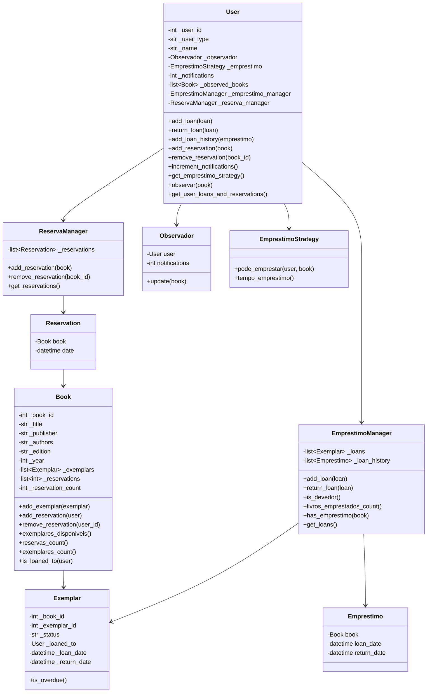
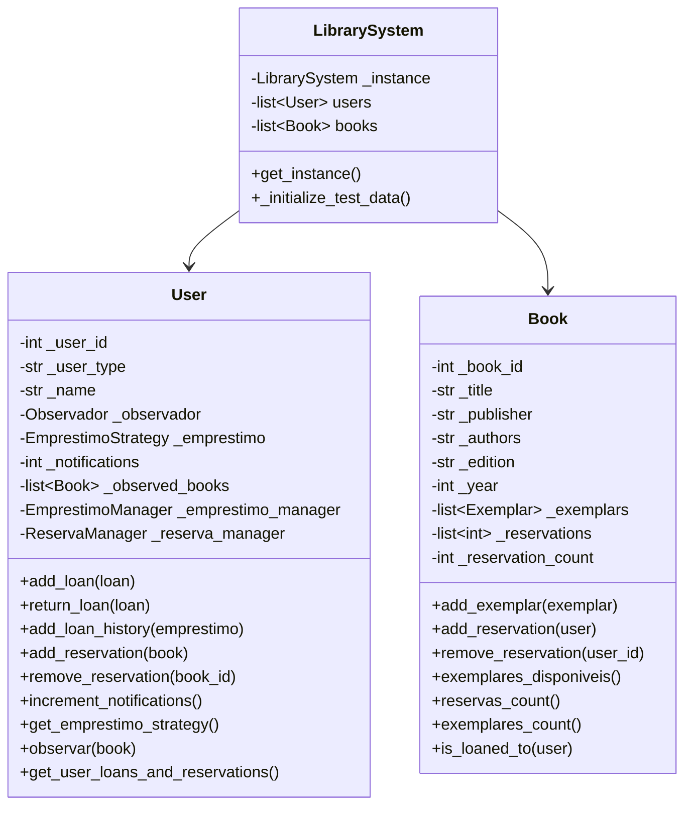

# Sistema de Biblioteca

## Diagramas de Classe

### Diagrama de Classe para `User`



### Diagrama de Classe para `LibrarySystem`



### Diagrama de Classe para `Command`

### Diagrama de Classe para `Command` (Parte 1)


### Diagrama de Classe para `Command` (Parte 2)


# Projeto MATA62 – Trabalho Prático: Sistema de Biblioteca

## Objetivo Geral

Desenvolver um sistema de gerenciamento de biblioteca em orientação a objetos que permita:
- Empréstimo, devolução e reserva de livros (com múltiplos exemplares);
- Registro de observação para professores sobre reservas;
- Consultas de informações de livros, usuários e notificações.

O sistema deve seguir os requisitos descritos no enunciado, utilizar os padrões de projeto (Singleton, Command e o padrão para seleção das regras de empréstimo sem condicionais) e ser implementado via linha de comando (sem interface gráfica).

---

# 📚 Sistema de Gerenciamento de Biblioteca Acadêmica  

Este é um sistema desenvolvido em **Python** para o gerenciamento de bibliotecas acadêmicas, utilizando **Programação Orientada a Objetos (POO)** e os padrões de projeto **Singleton, Command, Strategy e Observer**.  

## ✨ Funcionalidades  

✅ Cadastro de livros e exemplares.  
✅ Empréstimo de livros com diferentes regras para alunos e professores.  
✅ Devolução de livros.  
✅ Notificação de disponibilidade de livros.  
✅ Registro de usuários.  

## 🏗️ Arquitetura do Projeto  

O projeto está organizado nos seguintes módulos:  

---

### 📁 `models/` - Modelos principais  
- `book.py` → Representa um livro e seus exemplares.  
- `exemplar.py` → Representa uma cópia física de um livro.  
- `user.py` → Representa usuários da biblioteca.  

### 📁 `singleton/` - Gerenciamento central  
- `biblioteca.py` → Implementa o **Singleton**, garantindo que exista apenas uma instância da biblioteca.  

### 📁 `command/` - Execução de comandos  
- `commands.py` → Define comandos para operações como empréstimos.  

### 📁 `strategy/` - Estratégias de Empréstimo  
- `emprestimo.py` → Interface para estratégias de empréstimo.  
- `aluno_graduação.py` → Regras de empréstimo para alunos de graduação.  
- `aluno_pos_graduacao.py` → Regras para alunos de pós-graduação.  
- `professor.py` → Regras para professores.  

### 📁 `observer/` - Sistema de Notificações  
- `observers.py` → Gerencia a notificação de usuários sobre livros disponíveis.  

---

# 📌 Exemplo de uso

### Executando o Sistema

Para executar o sistema, siga os passos abaixo:

1. **Clone o repositório**:
    ```sh
    git clone https://github.com/seu-usuario/sistema-biblioteca.git
    cd sistema-biblioteca
    ```

2. **Instale as dependências** (se houver):
    ```sh
    pip install -r requirements.txt
    ```

3. **Execute o sistema**:
    ```sh
    python main.py
    ```

4. **Digite os comandos conforme necessário**:
    ```sh
    emp 123 100  # Empréstimo de livro
    dev 123 100  # Devolução de livro
    res 123 100  # Reserva de livro
    obs 100 100  # Observação de livro
    liv 100      # Consulta de informações de livro
    usu 123      # Consulta de informações de usuário
    ntf 100      # Consulta de notificações recebidas
    lus          # Listar todos os usuários cadastrados
    llv          # Listar todos os livros disponíveis
    sair         # Encerra o sistema
    ```

---

## 🔗 Tecnologias Utilizadas  

O projeto foi desenvolvido utilizando as seguintes tecnologias e conceitos:  

- **🐍 Python 3.10+** → Linguagem de programação principal do projeto.  
- **📦 Programação Orientada a Objetos (POO)** → Uso de classes e objetos para modularidade e reutilização de código.  
- **🛠️ Padrões de Projeto**:  
  - **Singleton** → Garantia de uma única instância da biblioteca.  
  - **Command** → Implementação de comandos para empréstimos e devoluções.  
  - **Strategy** → Regras de empréstimo diferentes para alunos e professores.  
  - **Observer** → Notificação de usuários sobre disponibilidade de livros.  
- **📝 Documentação com Markdown** → Estruturação do README e guias do projeto.  
- **🔄 Controle de versão com Git** → Gerenciamento de código e colaboração.
 ---

# ✍️ Projeto desenvolvido pelos alunos Juan Reis e João Paulo Bernardino para a disciplina de Engenharia de Software I.
